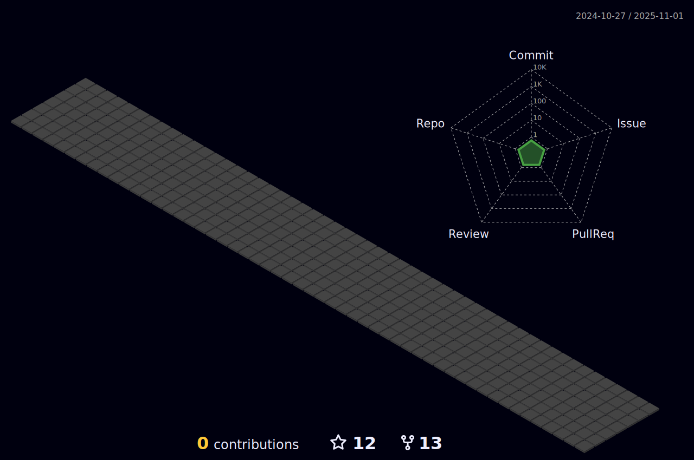

### Hi there, I'm Shanu 👋 
## Tech is my true passion, and I channel my enthusiasm into delivering exceptional results in my field.

 

- 📚  Always eager to learn stuff.
- 🔭 I’m currently working on small web development projects.
- 🌱 I’m currently learning the backend frame works using nodejs.
- 👯 I’m looking forward to contribute in open source.
- 📫 You can reach me through my mail : kumarshanupersonal@gmail.com.
- ⚡ Fun fact: I am a learner and wants to be the same throughout my life 😉.

 

### Connect with me:

 

[][linkedin]
[][youtube]
[][instagram]
[][twitter]
 
 
 
 

---
### Languages and Tools:

<!-- languages and tools -->

 

<!--  -->

 
 

---

### 📺  Latest YouTube Videos

<!-- YOUTUBE:START -->
- [Chapter 2 : Addition, deletion and modification of column, truncating and dropping the table. #DBMS](https://www.youtube.com/watch?v=5BOkmOSgybc)
- [Chapter 1 : Creating table, insetion of row and displaying the table in Oracle Apex. #ApexOracle](https://www.youtube.com/watch?v=DTwi-jojsqI)
- [How to create oracle apex workspace for data base management ? #Oracle_Apex #database #DBMS](https://www.youtube.com/watch?v=kCM63DZgR8s)
- [Let&#39;s Create Notion Database for College Classes. @Notion @NotionAtCollege](https://www.youtube.com/watch?v=WNPkhB3eba4)
- [Learn using Git in local repositories. #Github #Cli](https://www.youtube.com/watch?v=m8gWEF1Y6Ek)
<!-- YOUTUBE:END -->

---

## 📊 My Github Stats

   
    

  
   
  <b>Note:</b> Top languages is only a metric of the languages my public code consists of and doesn't reflect experience or skill level.

 
 
    

---
  ### Streak
  
  

    

                                                                                                     

    

## ❤ Views and Followers

---
  

  
---

### My Holopin Badges

### Hackathon Certificate

[twitter]: https://twitter.com/kumar_____shanu
[youtube]: https://www.youtube.com/channel/UCnT6Z9ay-snq1c0lZkEtYjg
[instagram]: https://www.instagram.com/kumar_____shanu/
[linkedin]: https://www.linkedin.com/in/kumar-shanu-011423189/
[gmail]:kumarshanupersonal@gmail.com
